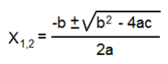

# Uvod v programiranje

## Naloga 1

Napišite algoritem, ki bo uporabniku pomagal pri sestavljanju stacionarnega računalnika. Upoštevajte podatek, da uporabnik še ni naročil komponent (pri čemer mu ni potrebno naročiti neobveznih komponent, npr. grafične ali zvočne kartice). Algoritem naj ima vsaj 10 korakov in vključuje vse zahtevane lastnosti ter atribut splošnosti (poudarek na neobveznih komponentah).

## Naloga 2

Sestavite algoritem, ki bo uporabniku omogočil vklop stacionarnega računalnika. Upoštevajte vse korake, ki so potrebni po tem, ko računalnik sestavi - od priklopa perifernih naprav do začetka uporabe programov. Algoritem naj ima vsaj 10 korakov in vključuje zahtevane lastnosti.

## Naloga 3

Napišite algoritem, ki bo uporabniku pomagal pri oblikovanju besedila v naslov znotraj programa za urejanje dokumentov. Upoštevajte, da se mora naslov nahajati na sredini, biti mora velikosti 24 pt in odebeljen. Predpostavite lahko, da je program za urejanje besedil že odprt. Algoritem naj ima vsaj 8 korakov in vključuje vse zahtevane lastnosti.

## Naloga 4

Predstavljajte si, da ob koncu šolskega leta pričnete opravljati poletno delo v obliki voditelja na lokalni radijski postaji. V namen pridobivanja večjega števila poslušalcev pričnete z nagradno igro z naslednjimi pravili:

- sprejmete 10 klicev poslušalcev
- vsak izmed poslušalcev se pred vklopom v eter predstavi z imenom in priimkom ter poda starost
- s pravilnim odgovorom na zastavljeno vprašanje sodeluje v žrebu za nagrado
- po zaključku sprejemanja klicev je pomen žreba izbira najstarejšega klicočega, ki je pravilno odgovoril

Potek zapišite v obliki algoritma, nato pa preučite ali ustreza podanim pravilom. Pri reševanju si lahko pomagate s tem, da v danem trenutku (pred zadnjim klicočim) še nimate na razpolago vseh podatkov. Algoritem mora imeti vse zahtevane lastnosti.

## Naloga 5

Spremenite podano matematično formulo v algoritem.

## Naloga 6

Sestavite algoritem, s katerim lahko opravite izris vzorca iz spodnje slike.

